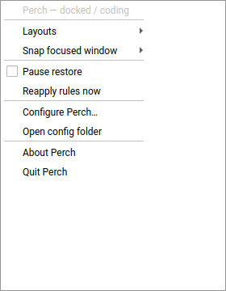
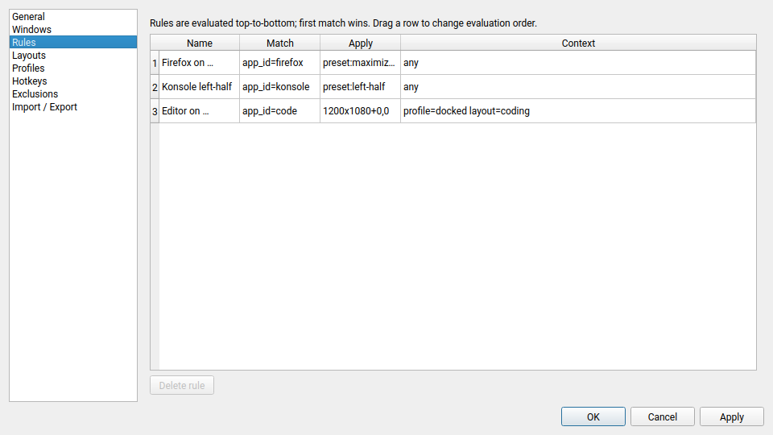

# 08 — UI

The user-facing surface of Perch: tray, config dialog, hotkeys, notifications.

## Principles

- **Tray-first.** The tray icon and its menu are the primary interface. Most users never open the config dialog; they toggle layouts from the menu.
- **Qt Widgets, not QML.** Widgets render correctly everywhere (X11, Wayland, HiDPI, theming) and don't pull in a QML runtime. Perch is not animation-heavy; QML buys nothing here.
- **Native look on Plasma, acceptable on everything else.** PySide6 + the Breeze style gives this for free. GNOME users will see a Qt dialog — this is called out in the README.
- **Progressive disclosure.** The tray shows the 10 actions people use daily. The dialog shows everything else.

## Screenshots

 — open tray menu with Layouts / Snap submenus, Pause restore toggle, and quick actions.

 — Rules section of the config dialog with three demo rules; drag a row to reorder.

Regenerate with `python3 scripts/render-screenshots.py` after any widget change. The script runs headless (`QT_QPA_PLATFORM=offscreen`) so it also works in CI.

## Tray icon

### Icon states

| State | Icon | Tooltip |
|---|---|---|
| Normal | `perch-tray-symbolic` (the bird silhouette) | "Perch — <active profile> / <active layout>" |
| No layout / no profile | same icon, muted | "Perch — idle" |
| Backend degraded | `perch-tray-warning-symbolic` | "Perch — backend disconnected" |
| Awaiting GNOME extension | `perch-tray-warning-symbolic` | "Perch — install the GNOME Shell extension to enable window management" |
| Missing (e.g. UI-only mode, unknown compositor) | `perch-tray-error-symbolic` | "Perch — no compatible compositor detected" |
| No tray host (GNOME Wayland without AppIndicator) | — (see below) | — |

The tray icon follows the user's icon theme; it ships in `hicolor` as a symbolic SVG so it recolours to match the panel. The status variants live at `data/icons/hicolor/symbolic/status/perch-tray{,-warning,-error}-symbolic.svg` and are resolved at runtime via `QIcon.fromTheme(...)` with the bundled SVG as the fallback — see `src/perch/ui/icons.py` and the `TrayIconState` enum in `src/perch/ui/tray.py`. The warning / error variants overlay a hard-coded amber / red badge on the silhouette; that small splash of colour survives panel recolouring, so a user whose theme inverts the silhouette still sees the state signal. Qt's SVG renderer handles every HiDPI scale factor natively, so no raster variants are shipped.

### Tray on GNOME Wayland — AppIndicator required

Phase 2 research finding: **`QSystemTrayIcon` on GNOME Wayland is not visible out of the box.** GNOME removed tray support in 3.26; the modern path is the `org.kde.StatusNotifierWatcher` / `org.freedesktop.StatusNotifier*` spec, which GNOME users access via the **AppIndicator** extension (widely installed, e.g. via Extension Manager).

PySide6's `QSystemTrayIcon` uses StatusNotifierItem where a host is registered, and silently does nothing where one isn't. `QSystemTrayIcon.isSystemTrayAvailable()` trusts the watcher and can return `True` with no host actually painting, so Perch runs a dedicated probe.

**SNI-host probe (M3 verified, 2026):**

1. On startup, before any tray instantiation, `sni_host_available()` checks:
   - The session bus has an owner for the well-known name `org.kde.StatusNotifierWatcher` (the freedesktop.org `org.freedesktop.StatusNotifierWatcher` rename never shipped — every real host still registers under `org.kde`).
   - The `IsStatusNotifierHostRegistered` property on `/StatusNotifierWatcher` returns `true`. A watcher without a host is a stale/deprecated state and must be treated as "no tray".
2. Implementation uses `sdbus_block` (sync) because the probe runs before the qasync event loop is live and we want the answer synchronously during startup. See `src/perch/ui/sni_probe.py`.
3. If the probe returns False **and** `$XDG_CURRENT_DESKTOP` contains `GNOME` **and** `$XDG_SESSION_TYPE == "wayland"`, Perch surfaces a first-run dialog: *"GNOME doesn't show tray icons by default. Please install the AppIndicator extension to see Perch in your top bar."* (Link to Extension Manager / EGO.) Perch still runs — the config dialog is reachable from `perch --settings` — but the tray is invisible.
4. If the probe returns False on any other desktop, Perch logs a warning and continues; tray icons are almost always present on KDE, Xfce, Cinnamon, MATE, LXQt. No first-run dialog there — Plasma/Xfce users don't need hand-holding, and showing the dialog would be noise.

Perch does **not** ship an AppIndicator compatibility wrapper (e.g. `libayatana-appindicator` via GObject Introspection). `QSystemTrayIcon` + SNI is sufficient everywhere there is a tray host; the GNOME case is a user-provisioning issue, not a code issue.

### Menu structure

Single left-click: opens the menu.
Middle-click: toggles "Pause restore" (a quick escape hatch — stops auto-restoring geometry).
Right-click: same as left-click (KDE-native right-click is preferred; left-click tolerated).

The menu is **regenerated and reassigned** whenever Perch's core state changes (active profile, active layout, known windows, pause-restore toggle). `QMenu.aboutToShow` is not used — QTBUG-55911 leaves that signal unemitted on Linux for menus attached to a `QSystemTrayIcon`, so Perch rebuilds eagerly on state-change signals from `perch.core` and calls `tray.setContextMenu(new_menu)`. The previous menu is reparented to the new one and destroyed by Qt.

```
┌────────────────────────────────────────┐
│ ● Perch — "Docked" / no layout         │   ← header, non-interactive
├────────────────────────────────────────┤
│   Layouts                    ▸          │   ← submenu
│      ○ (none)                            │
│      ● Coding                            │
│      ○ Writing                           │
│      ○ Media                             │
│      ─────                               │
│      Save current as new layout…         │
│      Manage layouts…                     │
├────────────────────────────────────────┤
│   Snap focused window        ▸          │   ← submenu
│      Maximize on this monitor            │
│      Left half                           │
│      Right half                          │
│      Top-left quarter                    │
│      Top-right quarter                   │
│      Bottom-left quarter                 │
│      Bottom-right quarter                │
│      Centre (60%)                        │
│      ─────                               │
│      My presets: <from [snaps]>          │
├────────────────────────────────────────┤
│   Windows                    ▸          │   ← submenu, lists all managed windows
│      Firefox — "…"                      │
│      Konsole — "~/perch"                │
│      VS Code — "~/perch"                │
│      (click: "show window actions")     │
├────────────────────────────────────────┤
│   Pause restore             [ ]         │   ← toggle
│   Reapply rules now                     │
├────────────────────────────────────────┤
│   Configure Perch…                      │
│   Open config folder                    │
├────────────────────────────────────────┤
│   About Perch                           │
│   Quit Perch                            │
└────────────────────────────────────────┘
```

**"Windows" submenu** → clicking a window opens a small popover with:

- Current geometry (editable: `x`, `y`, `w`, `h`).
- "Forget this window" (removes the remembered geometry).
- "Add rule from this window…" (prefills the rule editor).
- "Exclude this window from Perch."

## Config dialog

Single `QDialog`, resizable, opens from *Configure Perch…*. Left sidebar lists sections; right pane is the active section's editor. Standard OK/Apply/Cancel footer.

### Sections

1. **General**
   - Start at login (checkbox).
   - Restore geometry on open (checkbox).
   - Notify on restore (checkbox, default off).
   - Theme (Auto / Light / Dark).
   - Log verbosity (Info / Debug).
   - "Open config folder" button.

2. **Windows**
   - Live list of windows currently known to the backend: `(icon, app_id, title, geometry, monitor, desktop)`.
   - Per-row inline-editable `x / y / w / h`. Pressing Enter commits to the backend.
   - Row actions: "Forget", "Add rule", "Exclude".
   - Filter box; search across app_id / title.

3. **Rules**
   - Table of rules in evaluation order.
   - Drag handles in the leftmost column to reorder.
   - "+ Add rule" button opens a rule editor.
   - Per-rule: name, match fields, apply fields, context fields. Each field has inline validation (red outline + tooltip on errors).
   - **Dry-run toggle** — when on, rules are only logged to the trace panel, not applied.
   - **Rules trace panel** (collapsible at the bottom) — last 50 evaluations with timestamp, window identity, chosen rule, decision.

   **Implementation (M3):** `QTableView` backed by a `QAbstractTableModel` that owns a deep-copy of `list[Rule]` as its working store. On OK the dialog returns the new list; on Cancel the caller's original reference is untouched. Drag-to-reorder is `QAbstractItemView.InternalMove` with `setDragDropOverwriteMode(False)` and a `moveRows()` implementation that calls `beginMoveRows` / `endMoveRows` around a pop-and-reinsert on the backing list. A `QStyledItemDelegate` renders the red-outline-on-error indicator by reading a `Qt.UserRole` validation error stashed per cell. `QTableWidget` is deliberately not used — it mixes presentation with state and makes the dataclass round-trip fragile.

4. **Layouts**
   - List of named layouts.
   - Each layout opens into a layout editor: per-window match + target geometry.
   - "Save current window arrangement as new layout…" button — reads live window positions and builds a layout from them.
   - "Preview" button applies the layout temporarily; "Revert" restores the pre-preview geometry (per-window, using the same `RESTORE_LAST_SEEN` plumbing as the rules engine).

5. **Profiles**
   - List of monitor topologies Perch has seen.
   - Each profile → name, topology key, default layout.
   - "Current topology" is highlighted.
   - Editing is minimal: users name a topology and pick a default layout. The topology itself is derived, not hand-entered.

6. **Hotkeys**
   - One row per snap preset + one row per layout.
   - Click a row's key-capture widget to record a new combination.
   - Clearing unbinds it.
   - On Plasma, a "Open Plasma's Shortcuts settings" link opens System Settings to Perch's KGlobalAccel component for richer management.

7. **Exclusions**
   - Table of exclusion patterns (same shape as rule `match`).
   - "+ Add pattern" and drag-to-reorder.

8. **Import / Export**
   - "Export config…" → TOML file dialog.
   - "Import config…" → TOML file dialog → dry-run diff viewer → "Apply" / "Cancel".
   - "Include last-seen geometries" checkbox (off by default).

### Validation and error surfacing

- Invalid rules show inline red text on Apply; focus jumps to the first offender.
- Typing a field that references a non-existent output (e.g. `monitor = "DP-5"`) shows a yellow warning icon — not an error, since the output may appear later.
- Config-file parse errors encountered at startup open the dialog on first launch with a banner at the top explaining what failed.

## Notifications

Perch uses `QSystemTrayIcon.showMessage` (which on Linux routes to `org.freedesktop.Notifications`). Events that trigger a notification:

- **On restore** (if `notify_on_restore = true`): "Firefox restored to DP-1 (maximized)."
- **On profile switch**: "Switched to profile 'Docked'."
- **On backend disconnect**: "Perch: backend disconnected. Retrying…"
- **On config reload error**: "Perch: config.toml could not be loaded. Using last known good."

Notifications are *informational*, never actionable — the user doesn't need a notification to take action on a window.

## Hotkeys

Two paths depending on backend capability:

- **Backend-registered** (KWin via KGlobalAccel, X11 via `XGrabKey`): Perch registers the key with the system, system delivers the event, Perch handles it. This is preferred — hotkeys work even if the Perch dialog isn't focused.
- **Self-grabbed fallback**: not implemented in v1. If a backend reports `can_register_hotkeys = False` (Sway, Hyprland), the UI explains that hotkeys must be bound in the compositor's own config, pointing at a CLI invocation of Perch (coming in v1.x).

### Default bindings (shipped but unobtrusive)

None. Perch ships with **zero default hotkeys bound**. The hotkeys section lists them unbound, and the user picks their own. Rationale: any default will collide with some users' existing bindings, and having Perch steal a key on first run is a bad first impression.

A "Load suggested bindings" button offers a common set (`Meta+Left` for left-half, etc.) that the user can accept in one click.

### Key-capture widget (M3)

The per-row picker is `perch.ui.widgets.key_capture.HotkeyEdit`, a thin subclass of `QKeySequenceEdit` with:

- `setMaximumSequenceLength(1)` — Perch accelerators are single chords, not multi-key sequences.
- `setClearButtonEnabled(True)` (Qt 6.4+) — the built-in clear icon unbinds the action.
- A `keyPressEvent` override that filters bare `Key_Super_L` / `Key_Super_R` / `Key_Hyper_L` / `Key_Hyper_R` so modifier-only presses are ignored. On GNOME Wayland and wlroots-derived compositors the Super keysym arrives as `Key_Super_L` rather than `Qt::Key_Meta`, which would otherwise slip past `QKeySequenceEdit`'s built-in modifier filter (QTBUG-62102). KWin applies this transform compositor-side for its own Qt clients (D6828); the widget-level guard makes Perch portable to non-KWin Wayland.
- An `accelChanged(str)` signal carrying the sequence in `QKeySequence.PortableText` form (`"Meta+Left"`, `"Ctrl+Alt+T"`), empty string when cleared. Rejects bare printable keys with no modifier.

**Accelerator string formats.** Perch carries accelerators internally as Qt Portable Text (`Meta+Left`). The `XGrabKey` X11 path and the KGlobalAccel D-Bus path accept this form directly. The `org.freedesktop.portal.GlobalShortcuts` path wants the XDG Shortcuts spec form (uppercase modifier names — `LOGO/CTRL/ALT/SHIFT` — and xkbcommon keysyms), so a `portable_to_xdg()` translator maps at the portal boundary. See [03-backend-interface.md](03-backend-interface.md) §Hotkey accelerators.

**Portal vs direct KGlobalAccel.** `xdg-desktop-portal-gnome` did not implement `GlobalShortcuts` as of the 2026 snapshot; KDE's and Hyprland's portals do. Perch therefore tries the portal first (preferred for sandboxed Flatpak), falls back to KGlobalAccel D-Bus on Plasma-native sessions, and falls back to `XGrabKey` on X11. GNOME Wayland users without portal support cannot register global hotkeys and the UI says so (greyed rows with a tooltip); Perch does not self-grab in v1.

## Accessibility

- All dialog controls have accessible labels (`setAccessibleName`), relied on by orca and KWin's accessibility layer.
- Keyboard navigation is complete: every action reachable via Tab + Space / Enter.
- Colour is never the sole carrier of information (error rows also have an icon).
- HiDPI: icons are SVG, geometry values in the dialog are in logical pixels.

## Localization

- All user-visible strings wrapped in `self.tr(...)` on `QObject` subclasses; non-QObject helper code uses `QCoreApplication.translate("<context>", "...")`.
- Translation sources live at `translations/perch_<locale>.ts` (Qt Linguist XML). They are extracted from `.py` with `pyside6-lupdate $(git ls-files 'src/perch/**/*.py') -ts translations/perch_en.ts -source-language en_US` and compiled to `.qm` with `pyside6-lrelease`. Both commands ship with the `PySide6` wheel; no extra build dependency.
- The convention `po/` is deliberately **not** used — it's a gettext signal, and Qt's `.ts` format is not compatible with gettext `.po`. PySide6 ecosystem convention is `translations/`.
- Runtime loading is `src/perch/i18n.py` using `QTranslator.load(locale, "perch", "_", translations_dir)`. Translator instances are **module-level** so Python's GC doesn't reclaim them and silently revert translations — the #1 PySide6 i18n footgun. Lookup order for `translations_dir`: `$PERCH_TRANSLATIONS_DIR` → `/app/share/perch/translations` (Flatpak) → `$sys.prefix/share/perch/translations` (system install) → dev-checkout fallback.
- Localizable content: every UI string, every log message that is *shown* to the user. Log messages that only land in `perch.log` stay English — translating them adds noise for bug reports.

## What the UI does *not* do

- No inline rule editing via dragging windows on a mini-preview of the desktop. Intriguing idea; deferred to v2.
- No visual layout editor ("click where the window goes"). Also deferred.
- No "night mode schedule" or other time-based triggers. Out of scope.
- No status bar presence (just a tray icon). Tray is good enough and more universally supported than custom status-bar integrations.

## Interaction with the rest of the system

- **Menu updates**: the tray menu is regenerated on every open, driven from current state. Not held across opens.
- **Window list updates**: the "Windows" dialog pane subscribes to backend events and updates live.
- **Theme switching**: when `theme = auto`, Perch listens for `org.freedesktop.appearance` color-scheme changes (on KDE), and re-applies its palette. On other desktops, falls back to Qt's `QGuiApplication.styleHints().colorScheme()` (Qt 6.5+).
- **Icon theme**: whatever the user's Qt icon theme is; symbolic icons recolour automatically on Plasma's panel.

## Implementation notes (forward-looking)

- UI widgets live under `perch/ui/`:
  - `tray.py` — `TrayIcon(QSystemTrayIcon)` and menu builder.
  - `dialog.py` — `ConfigDialog(QDialog)` and its section widgets.
  - `widgets/` — re-usable bits (match editor, geometry editor, key capture).
- UI never imports from `perch.backend.*` directly. It reads from `perch.core.state` and fires `perch.core.intents`.
- Tests: `pytest-qt` drives the widget classes; the full dialog is exercised with a `MockBackend` preloaded with representative windows.
